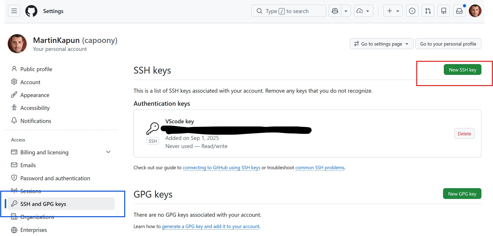
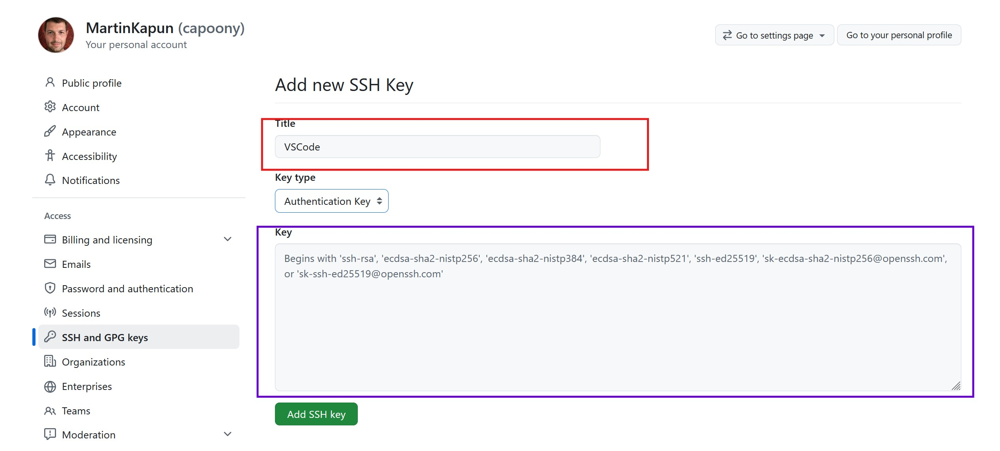
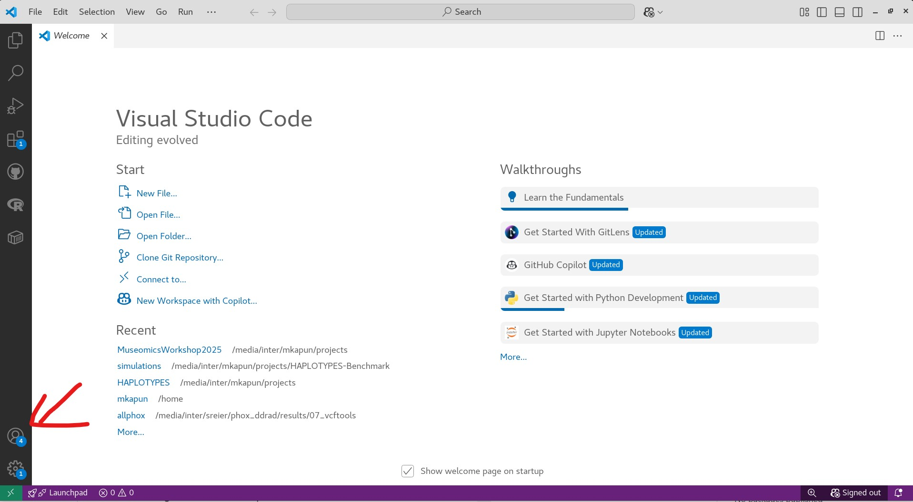
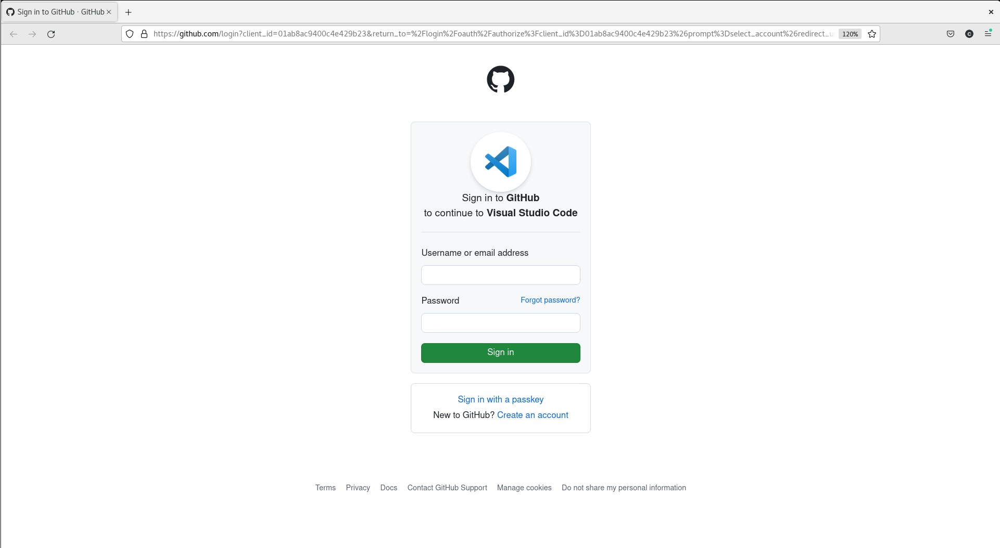

# Workshop III - GitHub & Data Management

GitHub is a cloud-based platform for storing, sharing, and collaborating on code using **Git** — a version control system that tracks every change you make to your files. Whether you are working alone or in a team, Git and GitHub let you keep a full history of your project, experiment safely in branches, and merge contributions without losing work.

In this workshop you will learn how to create repositories, connect your local machine to GitHub, and manage changes through the VSCode editor.

The slides to this workshop can be found [on Google Slides](https://docs.google.com/presentation/d/1Gpgd5MocTWWqo_unQImQB14VJrkZsUmto1m_VaD_Ii0/edit?slide=id.g112930cb4ee_2_50#slide=id.g112930cb4ee_2_50)

For additional very basic info to the usage of git, see the [Git basics in UNIXBasics](https://GitHub.com/nhmvienna/FirstSteps/blob/main/UNIXBasics/UNIXBasics.md#vii-using-git-for-version-control)

## Part A - Getting to know GitHub

### 1. GitHub webpage

The first task is to go to your GitHub webpage and create a new (first) Github Repo.

- Create your first repository (`My1stRepo`, etc.) — click `+ New repository` on your GitHub homepage
- Add a licence file (<https://choosealicense.com/licenses/>) — choose one during repo creation or add it afterwards
- Create a `README.md` file and add a short description — tick the box during repo creation
- Create a new text file in a folder — use the `Add file` button on the repo webpage
- Add an image to the new folder — drag and drop an image file when adding a new file
- Create a new branch and make edits to your `README.md` — use the branch dropdown on the repo webpage
- Merge your new branch with the main branch — open a Pull Request and click `Merge`
- Invite a collaborator — go to `Settings` → `Collaborators` and add their GitHub username

### 2. Git, GitHub and SSH authentication

The first thing you will need to do is to set your Name and GitHub account email to enable syncing to your GitHub cloud.

```bash
git config --global user.name "Your Name"
git config --global user.email "<your@email.com>"
```

Verify your configuration:

```bash
git config --list
```

As a next step, you will need to set up an SSH-key, which GitHub can use to authenticate your computer. Password authentication is no longer supported. SSH works with a **key pair**: a *private key* that stays on your machine (never share it!) and a *public key* that you give to GitHub. In the terminal, generate a new key pair with:

```bash
ssh-keygen -t ed25519 -C "<your@email.com>"
```

This will create two files in the hidden `~/.ssh/` directory of your home folder:

```bash
~/.ssh/id_ed25519      # your PRIVATE key — keep this secret
~/.ssh/id_ed25519.pub  # your PUBLIC key  — this goes to GitHub
```

Next, we will start the SSH-agent to organize the SSH-key authentication. Then, add your key:

```bash
eval "$(ssh-agent -s)"

## add key
ssh-add ~/.ssh/id_ed25519
```

Finally, you will need to copy your PUBLIC key and set up GitHub SSH authentication on the webpage. Therefore go to the [settings](https://github.com/settings/keys) page of GitHub and navigate to the `SSH and GPG keys` tab. There, click on `New SSH key`.



Come up with a meaningful title, e.g. `VSCode`.

Back in the Terminal, you need to get and copy the PUBLIC key. Therefore, display the public key using the `cat` command.

```bash
cat ~/.ssh/id_ed25519.pub
```

This will print the public key to the console. Mark the full string shown in the terminal and right-click copy the string to your clipboard. Now paste the full string in the `Key` field in Github and press `Add SSH key`.



Finally, verify that it has worked in the terminal by typing:

```bash
ssh -T git@github.com

## Success!!
Hi capoony! You've successfully authenticated, but GitHub does not provide shell access.
```

### 3. GitHub & VSCode

Now that your SSH key is set up, you can connect VSCode directly to your GitHub account. This allows you to stage, commit, push and pull without ever leaving the editor.

Before you start, have a quick refresher what VSCode is and how VSCode works in the [VSCode basics guide](https://GitHub.com/nhmvienna/FirstSteps/blob/main/VisualStudioCode_basics.md)

Find the login field on the GitHub tab on the right of the VSCode window and sign in with your GitHub account.




### 4. Clone a repository

```bash
## create GitHub directory in home folder

mkdir ~/github

cd ~/github

## check if your git is set up correctly
# (--global shows only the global config set in section 2)

git config --global --list

# 1) clone private My1stRepo repository
# Replace 'capoony' with your own GitHub username and 'My1stRepo' with your repo name

git clone git@github.com:capoony/My1stRepo.git

# 2) clone this public repository

git clone https://GitHub.com/nhmvienna/Workshop_III_GitHub
```

See also the [clone repository script](shell/clone_repository.sh)

Now add the newly cloned folder to the Workspace in VSCode by pressing `File` → `Add Folder to Workspace...` and select the folder you just cloned.

### 5. Publish a repo to GitHub

Create a new project folder which contains the data that you want to publish

```bash
## create GitHub directory in home folder

mkdir -p ~/github/My2ndRepo/data

cd ~/github/My2ndRepo

## lets add an empty text file in the data folder
touch data/TEST.md

## lets add a readme file in the main folder
echo '''
# Wow, second Repo 


:+1:

''' > README.md
```

Now add the newly created folder to the Workspace in VSCode by pressing `File` → `Add Folder to Workspace...` and select the folder you just created.

Then press `Ctrl+Shift+P` and type publish, or select `Publish to GitHub`

A new `.git` folder will appear within the project, which represents the git repository.
New files will appear in green as unstaged (and thus not yet version-controlled) files.

Let's make a new gitignore file, which will tell git to ignore certain files or folders, in this case, we will ignore the data folder

```bash
## add gitignore file
echo '''# ignore data folder
data/
''' > .gitignore

## lets make a second text file in the data folder
echo "This is a second file in the data folder" > data/second_file.txt

## lets make a third text file in the main folder
echo "This is a third file in the main folder" > third_file.txt
```

Before pushing to GitHub, changes go through two steps: **staging** (selecting which changes to include in the next snapshot) and **committing** (saving that snapshot with a message). Think of staging as packing a box and committing as sealing and labelling it.

- Open the source control tab on the left side of the VSCode window, which looks like a branch icon. Therefore use the shortcut `Ctrl+Alt+B` or click on the secondary side bar icon on the top left side of the VSCode window.

- Now, you can see the changes in the Source Control tab on the left side of the VSCode window.

- Type a brief description of the changes you made in the text box at the top of the Source Control tab.

- Then click on the plus icon next to the file name to stage the changes, or click on the plus icon next to the "Changes" header to stage all changes at once.

- Now you can commit by pressing the `Commit` button, which is also the checkmark icon at the top of the Source Control tab.

- Finally, you can push the changes to GitHub by clicking on the small button with the arrow pointing upwards at the top of the Source Control tab.

#### a) let's check the changes online

```bash
xdg-open https://github.com/capoony/My2ndRepo
```

> **Note:** Replace `capoony` with your own username. If `xdg-open` does not launch a browser, simply copy the URL and paste it into your browser manually.

#### b) let's make some additional changes online

- Go to the `README.md` file in the `My2ndRepo` repository on GitHub and click on the pencil icon to edit the file. Write some text, such as `This is my change on the *web*`.

- Now go back to VSCode. In the sidebar on the right click on the three dots next to the repo name and choose `Fetch` to fetch the changes you made online.

- Now you can see the changes in the Source Control tab on the left side of the VSCode window.

- Pull the changes by clicking on the small button with arrow pointing downwards at the top of the Source Control tab.

#### c) let's make some changes in VSCode

- On the server go to the `README.md` file in the `My2ndRepo` repository on your local machine and add a new line with the text `This is my change on **Phylo2**`.
Then save the file.

- Now you can see that the color of the file in the explorer on the left has changed to yellow.

- Go to the Source Control sidebar tab and you will see that the Readme is in a dropdown menu called `Changes`, above is a blue button and on top a field to type a message. Now you can type a brief description of the changes you made in the text box.

- Then click on the plus icon next to the file name to stage the changes, or click on the plus icon next to the "Changes" header to stage all changes at once.

- Now you can commit by pressing the `Commit` button, which is also the checkmark icon at the top of the Source Control tab.

- Finally, you can push the changes to GitHub by clicking on the small button with the arrow pointing upwards at the top of the Source Control tab.

#### d) let's break the system

A **merge conflict** occurs when the same part of a file has been changed in two different places (e.g. on the website and locally) and Git cannot automatically decide which version to keep. The following exercise deliberately creates this situation so you know how to resolve it.

- on the website, make a new file called `2Bbroken.txt` in the main folder

- write the following text: `Hello`

- commit the changes and go back to VSCode.

- pull the new file by pressing `Fetch` followed by `Pull`

- now go back to the website, make changes to the same file `Hel_lo` and commit.
  
- now edit the same file in VSCode to `Hell_o`, stage and commit - what happens???

- the solution is to use `stash` to basically freeze your staged changes in the background on the computer, then pull the changes from the website and then use `pop` to bring back your changes from the background. Now you have the possibility to compare the changes and pick your favourite in the merge editor.

```bash
## freeze your local changes
git stash

## pull the remote changes
git pull

## restore your local changes on top
git stash pop
```

- :warning: **Always PULL before you make changes to your code to make sure that you are working on the latest version**
- :warning: **Only make changes on the website if REALLY necessary**
- :warning: **Use branches, see below**

#### e) branches

A **branch** is an independent parallel version of your repository. You can make changes on a branch without affecting the main code, and merge it back when you are happy with the result. This is the recommended way to develop new features or experiment safely.

- Go to the `README.md` file in the `My2ndRepo` repository on your local machine and add a new line with the text `new branch`.
Then save the file.

- Now you can see the changes in the Source Control tab on the left side of the VSCode window.

- Create a new branch by clicking on the branch icon at the top of the Source Control tab and selecting `Create Branch...`. Name the branch `new`.

- Now press `Publish Branch` to publish the new branch to GitHub.

- Type a brief description of the changes you made in the text box at the top of the Source Control tab.

- Then click on the plus icon next to the file name to stage the changes, or click on the plus icon next to the "Changes" header to stage all changes at once.

- Now you can commit by pressing the `Commit` button, which is also the checkmark icon at the top of the Source Control tab.

- Finally, you can push the changes to GitHub by clicking on the small button with the arrow pointing upwards at the top of the Source Control tab.

- Go to the website and merge the two branches.

### 6. Restoring a specific commit

Every commit in git is identified by a unique SHA-1 hash (e.g. `a3f5c2d`). You can use this hash to inspect or fully restore your repository to any earlier state — useful when you accidentally break something or want to recover a previous version of a file.

#### Step 1 — Find the commit you want to restore

In the terminal, list the commit history:

```bash
cd ~/github/My2ndRepo
git log --oneline
```

This prints a compact list of all commits, most recent first:

```text
e7b91a2 Fix typo in README
a3f5c2d Add third_file.txt
8d4e01f Initial commit
```

Copy the hash of the commit you want to go back to (e.g. `a3f5c2d`).

You can also browse the history visually in VSCode by opening the Source Control tab and clicking on `View History`.

#### Step 2 — Inspect the old state without changing anything (safe)

To look at what the repository looked like at that commit without touching your current work:

```bash
git switch --detach a3f5c2d
```

Your repository is now in *detached HEAD* state — you are browsing the past. No changes are made to your branch. When you are done exploring, return to your branch:

```bash
git switch main
```

#### Step 3a — Restore a single file from an old commit

If you only want to recover one specific file (e.g. `README.md`) from an earlier commit, without touching anything else:

```bash
git restore --source=a3f5c2d README.md
```

The file is restored in your working directory and staged automatically. Review it, then commit:

```bash
git commit -m "Restore README.md from commit a3f5c2d"
git push
```

#### Step 3b — Restore the entire repository to an old commit (soft, keeps history)

The safest way to roll back everything while keeping your full commit history is `git revert`. It creates a new commit that undoes the changes introduced since the target commit:

```bash
## revert a single bad commit (undoes only that one commit)
git revert a3f5c2d

git push
```

If you need to undo a whole range of commits back to `a3f5c2d`:

```bash
## revert all commits from HEAD back to (but not including) a3f5c2d
git revert a3f5c2d..HEAD

git push
```

## Part B - Data Management

Here we demonstrate how to find large and uncompressed files in a project folder, compress them to save disk space, and evaluate whether they can be cleaned up.

A useful command to check folder sizes at any time is:

```bash
## print a human-readable summary of disk usage for a folder
du -hs <folder>
```

### 1. Find large files

Navigate to the DataManagement pipeline and inspect the available scripts:

```bash
## go to the pipeline directory
cd /media/inter/pipelines/DataManagement

## list scripts with sizes and timestamps
ls -lht
```

Use `FindBIGdata.sh` to scan a project folder for large uncompressed and compressed files. The results are written to a `cleanup/` subfolder inside the target directory:

```bash
## --target  the project folder to scan
## --size    minimum file size in MB to report (here: 300 MB)
sh FindBIGdata.sh \
    --target /media/inter/mkapun/projects/ArdeaInsignis_PopGen \
    --size 300
```

### 2. Compress large files

Once `FindBIGdata.sh` has run, use `CompressBIGdata.sh` to compress the files it found. Only `--target` is needed — the script automatically picks up all file lists in the `cleanup/` folder:

```bash
## --target  same project folder used in FindBIGdata.sh
## compresses uncompressed files found in cleanup/ using pigz
sh CompressBIGdata.sh \
    --target /media/inter/mkapun/projects/ArdeaInsignis_PopGen
```

### 3. Create a new project folder

Use `template_projectfolders.sh` to scaffold a new project directory with all standard subfolders and a `README.md`:

```bash
## create a new project folder with subfolders: data/, results/, shell/, scripts/
sh template_projectfolders.sh /media/inter/mkapun/projects/NewCOOLDrosoProject

## verify the folder structure was created
ls -lht /media/inter/mkapun/projects/NewCOOLDrosoProject
```
